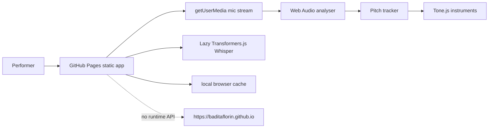

# Voice-as-Instrument Transformer

Live site: https://baditaflorin.github.io/voice-as-instrument-transformer/

Repository: https://github.com/baditaflorin/voice-as-instrument-transformer

Support: https://www.paypal.com/paypalme/florinbadita

Turn live speech or singing into pitch-tracked Rhodes, cello, and synth performances in the browser. The app uses browser mic input, Web Audio analysis, pitch tracking, Tone.js instruments, and lazy local Whisper transcription without a runtime backend.


## Quickstart

```bash
npm install
make install-hooks
make dev
make test
make smoke
```

## What v0.1.0 Includes

- Live mic pitch tracking with a browser-safe demo path.
- Rhodes, cello, and synth Tone.js instruments controlled by vocal pitch and level.
- Sensitivity, glide, octave, dry voice, and Demucs-lite focus controls.
- Lazy Whisper tiny transcription for short captured phrases.
- GitHub Pages deployment with version, commit, repository, and PayPal links in the app.

## Architecture



ADR index: docs/adr/

Architecture notes: docs/architecture.md

Deployment notes: docs/deploy.md

Privacy notes: docs/privacy.md

Postmortem: docs/postmortem.md

## Development

```bash
make help
make dev
make build
make lint
make test
make smoke
make pages-preview
```

The app is Mode A: Pure GitHub Pages. Build output goes to `dist/`, and `npm run deploy:pages` publishes it to the `gh-pages` branch. No backend, Docker image, server secrets, or runtime database are used.

## Security

No secrets belong in this project. The frontend has no API keys. Local hooks include linting, TypeScript checks, Conventional Commits, and staged secret scanning via `gitleaks` when installed.
