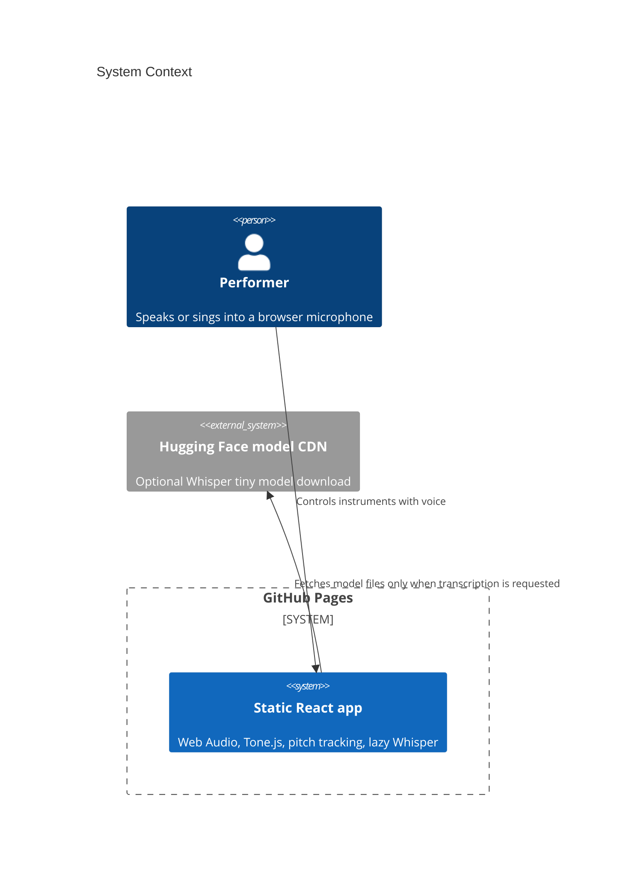
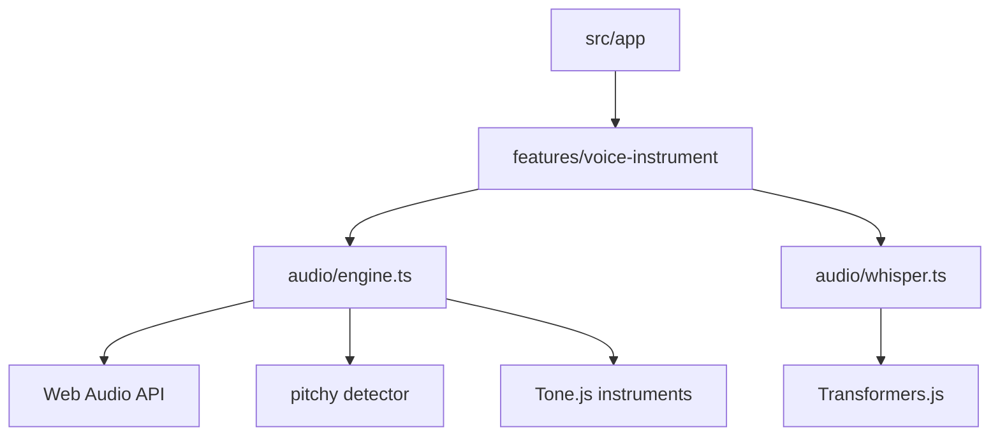

# Architecture

Voice-as-Instrument Transformer is a Mode A static web app served by GitHub Pages.

The GitHub Pages boundary is explicit: the deployed app is static HTML, CSS, JS, and public assets. There is no runtime API.
